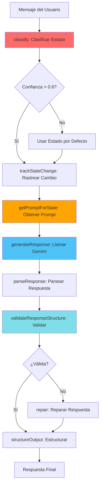

# Agente: Sistema de IA Adaptativa

## Propósito

Este agente documenta el funcionamiento del **Sistema de Asistencia Adaptativa** de Whispers of the Wave, que es el cerebro de la aplicación. Este sistema clasifica el estado emocional del usuario y genera respuestas contextuales apropiadas.

## Componentes del Sistema

### 1. AdaptiveAssistance (`core/adaptiveAssistance.js`)

**Clase principal** que orquesta todo el proceso de generación de respuestas adaptativas.

#### Responsabilidades

1. **Clasificación de Estado**: Determina el estado emocional del usuario
2. **Selección de Patrón**: Elige el patrón de respuesta apropiado
3. **Generación de Respuesta**: Llama a Gemini API con el prompt correcto
4. **Validación**: Asegura que la respuesta tenga el formato correcto
5. **Rastreo de Estado**: Mantiene historial de transiciones

#### Configuración

```javascript
const ADAPTIVE_CONFIG = {
    enableStateTracking: true,      // Rastrea cambios de estado
    confidenceThreshold: 0.6,       // Umbral de confianza mínimo
    maxStateHistory: 50,            // Máximo de estados en historial
    enableMultiLanguage: true,      // Soporte multiidioma
    defaultState: 'NEUTRAL_CHAT',   // Estado por defecto
    emotionalPriority: true,        // Priorizar análisis emocional
    enableLogging: true             // Logging de debug
};
```

#### Flujo de Procesamiento



### 2. StateClassifier (`core/stateClassifier.js`)

**Clasificador de estados emocionales** basado en análisis de texto.

#### Estados Soportados

| Estado | Descripción | Acción |
|--------|-------------|--------|
| `LOST_DIRECTION` | Usuario perdido, sin dirección clara | `life_questioning` |
| `EMOTIONAL_LOW` | Estado emocional bajo, necesita apoyo | `emotional_soothing` |
| `SEEKING_DECISION` | Buscando ayuda para decidir | `decision_matrix` |
| `NEED_ORIENTATION` | Necesita pasos concretos | `action_roadmap` |
| `SELF_EXPRESSION` | Expresión personal, necesita escucha | `reflective_mirror` |
| `NEUTRAL_CHAT` | Conversación casual | `neutral_chat` |

#### Método de Clasificación

```javascript
classify(message, context) {
    // 1. Analizar palabras clave
    // 2. Evaluar tono emocional
    // 3. Considerar historial de conversación
    // 4. Calcular confianza
    // 5. Retornar clasificación
    
    return {
        state: 'LOST_DIRECTION',
        confidence: 0.85,
        emotionalTone: 'confused',
        timestamp: Date.now()
    };
}
```

#### Indicadores de Estado

**LOST_DIRECTION:**
- Palabras: "no sé qué hacer", "perdido", "sin rumbo", "qué hago con mi vida"
- Preguntas existenciales sobre propósito
- Falta de claridad sobre el futuro

**EMOTIONAL_LOW:**
- Palabras: "triste", "solo", "vacío", "dolor", "mal"
- Expresiones de sufrimiento emocional
- Necesidad de validación

**SEEKING_DECISION:**
- Palabras: "debería", "o", "elegir", "decidir"
- Presentación de opciones
- Solicitud de consejo

**NEED_ORIENTATION:**
- Palabras: "cómo", "pasos", "plan", "empezar"
- Necesidad de acción concreta
- Busca guía práctica

**SELF_EXPRESSION:**
- Narrativa personal
- Compartir experiencias
- No solicita soluciones

**NEUTRAL_CHAT:**
- Conversación ligera
- Sin carga emocional fuerte
- Exploración casual

### 3. ResponsePatterns (`core/responsePatterns.js`)

**Biblioteca de patrones de respuesta** para cada estado.

#### Estructura de Patrones

Cada patrón incluye:
- **Prompt del Sistema**: Instrucciones para Gemini
- **Tono**: Cómo debe responder (empático, analítico, etc.)
- **Formato**: Estructura de la respuesta
- **Ejemplos**: Casos de uso

#### Ejemplo: Life Questioning Pattern

```javascript
LIFE_QUESTIONING: {
    systemPrompt: `
        Eres un guía existencial que ayuda a las personas a encontrar 
        su propósito. Haz preguntas profundas que lleven a la reflexión.
        
        FORMATO DE RESPUESTA:
        {
            "whisper": "Pregunta profunda o reflexión poética",
            "reflection": "Invitación a explorar más profundo"
        }
        
        TONO: Empático, profundo, sin juzgar
        OBJETIVO: Ayudar a descubrir propósito, no dar respuestas
    `,
    
    examples: [
        {
            input: "No sé qué hacer con mi vida",
            output: {
                whisper: "🌊 Las olas no saben a dónde van, pero confían en la marea. ¿Qué te hace sentir vivo cuando lo haces?",
                reflection: "Piensa en los momentos donde el tiempo se detiene para ti."
            }
        }
    ]
}
```

### 4. ResponseValidator (`core/responseValidator.js`)

**Validador de respuestas** de Gemini para asegurar formato correcto.

#### Validaciones

1. **Estructura**: Verifica campos `whisper` y `reflection`
2. **Contenido**: Asegura que no estén vacíos
3. **Formato**: Detecta JSON mal formado
4. **Reparación**: Intenta arreglar respuestas inválidas

#### Proceso de Reparación (lenientParse)

```javascript
lenientParse(text) {
    // 1. Extracción de Bloques de Código: Busca ```json ... ```
    // 2. Extracción de Objeto Crudo: Busca { "whisper": ... }
    // 3. División Heurística:
    //    - Intenta dividir por doble salto de línea (párrafos)
    //    - Intenta dividir por salto de línea simple buscando '?' o emojis
    // 4. Fallback: Usa todo el texto como whisper y añade reflexión por defecto
}
```

### 6. ClosurePrompts (`prompts/adaptivePrompts.js`)

**Sistema de cierre de conversaciones** para finales naturales y poéticos.

#### Tipos de Cierre
- `CLARITY_CELEBRATION`: Cuando el usuario encuentra claridad.
- `ACTION_SENDOFF`: Cuando el usuario decide actuar.
- `EMOTIONAL_BLESSING`: Después de sanación emocional.
- `NATURAL_FAREWELL`: Despedida casual.
- `JOURNEY_SUMMARY`: Resumen tras larga conversación.

### 5. ConversationEnhancer (`core/conversationEnhancer.js`)

**Mejorador de contexto** que analiza la conversación para enriquecer respuestas.

#### Análisis de Contexto

```javascript
analyzeContext(message, history) {
    return {
        emotionalProgression: [...],  // Evolución emocional
        topicsDiscussed: [...],       // Temas tratados
        questioningDepth: 0.7,        // Profundidad de exploración
        expressionQuality: 0.8,       // Calidad de expresión
        needsSupport: true,           // Necesita apoyo
        readyForAction: false         // Listo para acción
    };
}
```

## Transiciones de Estado

### Validación de Transiciones

El sistema valida que las transiciones sean lógicas:

```javascript
validateStateTransition(fromState, toState) {
    const expectedTransitions = {
        'EMOTIONAL_LOW': ['NEUTRAL_CHAT', 'SELF_EXPRESSION', 'LOST_DIRECTION'],
        'LOST_DIRECTION': ['NEED_ORIENTATION', 'SEEKING_DECISION', 'NEUTRAL_CHAT'],
        'SEEKING_DECISION': ['NEED_ORIENTATION', 'NEUTRAL_CHAT', 'LOST_DIRECTION'],
        'NEED_ORIENTATION': ['NEUTRAL_CHAT', 'LOST_DIRECTION'],
        'SELF_EXPRESSION': ['EMOTIONAL_LOW', 'NEUTRAL_CHAT', 'LOST_DIRECTION'],
        'NEUTRAL_CHAT': ['*'] // Puede ir a cualquier estado
    };
    
    // Detecta transiciones rápidas (< 5s)
    // Asegura validación emocional antes de profundizar
    // Registra patrones inusuales
}
```

### Reglas de Transición

1. **Desde EMOTIONAL_LOW**: Requiere al menos 30s de validación emocional antes de cambiar
2. **Transiciones Rápidas**: Alertas si hay cambios < 5s
3. **Transiciones Inesperadas**: Se registran para análisis

## Integración con Gemini API

### Construcción del Historial

```javascript
buildConversationHistory(currentMessage, context) {
    const history = [];
    
    // Agregar mensajes previos
    if (context.history) {
        history.push(...context.history);
    }
    
    // Agregar mensaje actual
    history.push({
        role: 'user',
        content: currentMessage
    });
    
    return history;
}
```

### Llamada a Gemini

```javascript
async generateResponse(message, systemPrompt, context) {
    const conversationHistory = this.buildConversationHistory(message, context);
    
    const response = await this.geminiService.sendMessage(
        conversationHistory,
        systemPrompt
    );
    
    return response;
}
```

## Manejo de Errores

### Respuestas de Error

Cuando falla la generación, se usan respuestas oceánicas:

```javascript
createErrorResponse(error) {
    const errorMessages = [
        {
            whisper: "🌊 Las olas se han vuelto turbulentas por un momento.",
            reflection: "¿Podrías intentar de nuevo?"
        },
        {
            whisper: "🌊 Una corriente inesperada ha interrumpido el flujo.",
            reflection: "¿Me compartes tu mensaje otra vez?"
        }
    ];
    
    // Seleccionar mensaje aleatorio
    return errorMessages[Math.floor(Math.random() * errorMessages.length)];
}
```

## Estadísticas y Debugging

### Métricas Disponibles

```javascript
// Obtener historial de estados
getStateHistory()

// Obtener estadísticas de estados
getStatistics()  // { LOST_DIRECTION: 5, EMOTIONAL_LOW: 3, ... }

// Obtener fallos de validación
getValidationFailures()

// Obtener fallos de generación
getGenerationFailures()

// Obtener patrones de transición
getTransitionPatterns()
```

### Logging

En modo desarrollo (`localhost`):

```javascript
// Logs automáticos
🌊 Processing message with adaptive assistance...
🎭 Emotional analysis: { tone: 'confused', intensity: 0.7 }
🔄 State transition: NEUTRAL_CHAT → LOST_DIRECTION
📝 Using pattern: life_questioning for state: LOST_DIRECTION
✅ Adaptive response generated
```

## Ejemplo Completo de Flujo

```javascript
// 1. Usuario envía mensaje
const userMessage = "No sé qué hacer con mi vida, me siento perdido";

// 2. Clasificación
const classification = {
    state: 'LOST_DIRECTION',
    confidence: 0.92,
    emotionalTone: 'confused',
    timestamp: 1234567890
};

// 3. Selección de prompt
const systemPrompt = ResponsePatterns.getPrompt('life_questioning', context);

// 4. Generación vía Gemini
const geminiResponse = await GeminiService.sendMessage(history, systemPrompt);

// 5. Parseo
const parsed = {
    whisper: "🌊 El océano también se siente perdido a veces, pero cada ola encuentra su camino. ¿Qué te hacía sentir con propósito antes?",
    reflection: "Piensa en los momentos donde sentiste que estabas en el lugar correcto."
};

// 6. Validación
const validation = { valid: true };

// 7. Estructura final
const output = {
    persona: 'kiro',
    mode: 'LOST_DIRECTION',
    action: 'life_questioning',
    text: {
        whisper: parsed.whisper,
        reflection: parsed.reflection
    },
    next_step: 'Continue Life Questioning progression'
};

// 8. Retorno a main.js para renderizado
```

## Extensión del Sistema

### Agregar un Nuevo Estado

1. **Definir en StateClassifier:**
```javascript
const NEW_STATE = 'MY_NEW_STATE';
```

2. **Agregar indicadores:**
```javascript
detectMyNewState(message) {
    const keywords = ['palabra1', 'palabra2'];
    return keywords.some(k => message.includes(k));
}
```

3. **Crear patrón en ResponsePatterns:**
```javascript
MY_NEW_STATE: {
    systemPrompt: "...",
    examples: [...]
}
```

4. **Mapear acción:**
```javascript
STATE_TO_ACTION['MY_NEW_STATE'] = 'my_new_action';
```

5. **Definir next_step:**
```javascript
case 'MY_NEW_STATE':
    return 'Guidance for this state';
```

## Mejores Prácticas

1. **Siempre validar respuestas**: No asumir que Gemini retorna formato correcto
2. **Rastrear transiciones**: Ayuda a mejorar la clasificación
3. **Usar caché**: Evita llamadas API duplicadas
4. **Logging en desarrollo**: Facilita debugging
5. **Manejo de errores graceful**: Siempre tener respuesta de fallback
6. **Validación emocional**: Especialmente importante desde EMOTIONAL_LOW

## Recursos Relacionados

- [ARQUITECTURA_DETALLADA.md](./ARQUITECTURA_DETALLADA.md) - Arquitectura completa
- [AGENTE_SISTEMA_OCEANICO.md](./AGENTE_SISTEMA_OCEANICO.md) - Sistema de océano
- [FLUJO_DATOS.md](./FLUJO_DATOS.md) - Flujo de datos completo
