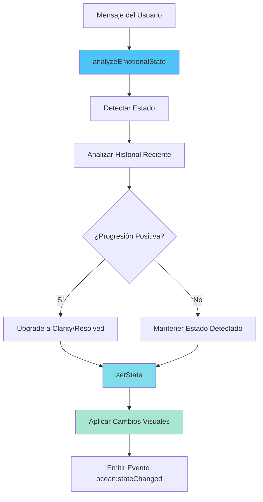

# Agente: Sistema Oceánico

## Propósito

Este agente documenta el **Sistema de Dinámica del Océano** (Ocean Dynamics), que es el corazón visual y emocional de Whispers of the Wave. El océano cambia de color, velocidad y comportamiento según el estado emocional de la conversación.

## Componente Principal

### OceanDynamics (`engine/oceanDynamics.js`)

Módulo singleton que controla la apariencia y comportamiento del fondo oceánico animado.

## Estados del Océano

### Configuración de Estados

```javascript
const states = {
    confused: {
        id: 'confused',
        name: 'Confusión',
        speed: 8,  // segundos por ciclo de animación
        colors: {
            dark: ['#ff6b6b', '#ee5a6f', '#c44569', '#8b2635'],
            light: ['#ffb3ba', '#ff8fa3', '#ff6b9d', '#ff5e78']
        },
        intensity: 'high',
        description: 'Pensamientos dispersos, necesita claridad'
    },
    // ... más estados
};
```

### Los 6 Estados

#### 1. Confused (Confusión) 🔴

**Características:**
- **Colores**: Rojos y rosas intensos
- **Velocidad**: 8s (rápida, agitada)
- **Intensidad**: Alta
- **Cuándo**: Pensamientos dispersos, falta de claridad

**Paleta Dark:**
- `#ff6b6b` - Rojo coral
- `#ee5a6f` - Rojo rosado
- `#c44569` - Rojo oscuro
- `#8b2635` - Rojo profundo

**Paleta Light:**
- `#ffb3ba` - Rosa claro
- `#ff8fa3` - Rosa medio
- `#ff6b9d` - Rosa intenso
- `#ff5e78` - Rosa coral

#### 2. Anxious (Ansiedad) 🟠

**Características:**
- **Colores**: Naranjas vibrantes
- **Velocidad**: 6s (muy rápida, nerviosa)
- **Intensidad**: Alta
- **Cuándo**: Preocupación, necesita calma

**Paleta Dark:**
- `#ffa502` - Naranja brillante
- `#ff7f50` - Coral
- `#ff6348` - Tomate
- `#e84118` - Rojo naranja

**Paleta Light:**
- `#ffd89b` - Naranja pastel
- `#ffb347` - Naranja claro
- `#ff9a3c` - Naranja medio
- `#ff8c42` - Naranja intenso

#### 3. Processing (Procesando) 🔵

**Características:**
- **Colores**: Azules claros
- **Velocidad**: 12s (media, reflexiva)
- **Intensidad**: Media
- **Cuándo**: Explorando ideas, en progreso

**Paleta Dark:**
- `#4fc3f7` - Azul cielo
- `#29b6f6` - Azul claro
- `#039be5` - Azul medio
- `#0277bd` - Azul profundo

**Paleta Light:**
- `#a8e6ff` - Azul muy claro
- `#7dd3fc` - Azul celeste
- `#4fc3f7` - Azul cielo
- `#29b6f6` - Azul brillante

#### 4. Clarity (Claridad) 💠

**Características:**
- **Colores**: Azules muy claros, cyan
- **Velocidad**: 18s (lenta, tranquila)
- **Intensidad**: Baja
- **Cuándo**: Entendimiento emergente

**Paleta Dark:**
- `#80deea` - Cyan claro
- `#b3e5fc` - Azul muy claro
- `#e1f5fe` - Azul casi blanco
- `#b2ebf2` - Cyan pastel

**Paleta Light:**
- `#e0f7fa` - Cyan muy claro
- `#b2ebf2` - Cyan pastel
- `#80deea` - Cyan medio
- `#4dd0e1` - Cyan brillante

#### 5. Resolved (Resolución) 🟢

**Características:**
- **Colores**: Verdes, pasteles cálidos
- **Velocidad**: 25s (muy lenta, pacífica)
- **Intensidad**: Muy baja
- **Cuándo**: Paz y comprensión alcanzadas

**Paleta Dark:**
- `#a8e6cf` - Verde menta
- `#dcedc1` - Verde claro
- `#ffd3b6` - Melocotón
- `#ffaaa5` - Rosa salmón

**Paleta Light:**
- `#c8f7dc` - Verde muy claro
- `#e8f5e9` - Verde pastel
- `#fff9c4` - Amarillo claro
- `#ffe0b2` - Naranja pastel

#### 6. Neutral (Neutral) 🌊

**Características:**
- **Colores**: Azules profundos, turquesa
- **Velocidad**: 15s (media)
- **Intensidad**: Media
- **Cuándo**: Estado inicial, exploratorio

**Paleta Dark:**
- `#0a1128` - Azul muy oscuro
- `#001f54` - Azul marino
- `#1a4d6d` - Azul océano
- `#40e0d0` - Turquesa

**Paleta Light:**
- `#e1f5fe` - Azul muy claro
- `#b3e5fc` - Azul celeste
- `#81d4fa` - Azul claro
- `#4fc3f7` - Azul cielo

## Análisis Emocional

### Método: analyzeEmotionalState()

Analiza el mensaje del usuario para detectar el estado emocional.

```javascript
analyzeEmotionalState(message) {
    const text = message.toLowerCase();
    
    // Detectar palabras clave para cada estado
    const confusionWords = ['no sé', 'confundido', 'perdido', 'no entiendo'];
    const anxietyWords = ['preocupado', 'miedo', 'ansiedad', 'nervioso'];
    const clarityWords = ['entiendo', 'claro', 'comprendo', 'veo'];
    const resolutionWords = ['gracias', 'mejor', 'ayudó', 'paz'];
    const processingWords = ['por qué', 'cómo', 'cuándo', 'quizás'];
    
    // Calcular scores
    const scores = {
        confused: confusionScore * 2,
        anxious: anxietyScore * 2,
        clarity: clarityScore * 1.5,
        resolved: resolutionScore * 2,
        processing: processingScore
    };
    
    // Retornar estado con mayor score
    return maxScoreState || 'neutral';
}
```

### Palabras Clave por Estado

**Confusión:**
- Español: "no sé", "confundido", "perdido", "no entiendo", "qué hago"
- Inglés: "confused", "lost", "don't know"

**Ansiedad:**
- Español: "preocupado", "miedo", "ansiedad", "nervioso", "estresado"
- Inglés: "worried", "anxious", "scared", "stress"

**Claridad:**
- Español: "entiendo", "claro", "comprendo", "veo", "ahora sí"
- Inglés: "understand", "clear", "see", "got it"

**Resolución:**
- Español: "gracias", "mejor", "ayudó", "paz", "tranquilo", "resuelto"
- Inglés: "thanks", "better", "helped", "peace", "resolved"

**Procesando:**
- Español: "por qué", "cómo", "cuándo", "quizás", "tal vez", "podría"
- Inglés: "why", "how", "when", "maybe", "perhaps"

## Actualización del Estado

### Método: updateFromConversation()



### Detección de Progresión

El sistema analiza los últimos 5 mensajes para detectar progresión hacia resolución:

```javascript
// Analizar mensajes recientes
const recentMessages = history.slice(-5);
let progressionScore = 0;

recentMessages.forEach((msg, index) => {
    const state = this.analyzeEmotionalState(msg.content);
    if (state === 'clarity' || state === 'resolved') {
        progressionScore += (index + 1);  // Más peso a mensajes recientes
    }
});

// Upgrade de estado si hay progresión clara
if (progressionScore > 8) {
    finalState = 'clarity';
}
if (progressionScore > 15) {
    finalState = 'resolved';
}
```

## Aplicación Visual

### Método: applyState()

```javascript
applyState(stateId, animate = true) {
    const state = this.states[stateId];
    const ocean = document.querySelector('.ocean-background');
    
    // Obtener colores según tema actual
    const colors = state.colors[this.currentTheme];
    const gradient = `linear-gradient(135deg, ${colors.join(', ')})`;
    
    if (animate) {
        // Transición suave de 2 segundos
        ocean.style.transition = 'background 2000ms ease-in-out';
    }
    
    // Aplicar estilos
    ocean.style.background = gradient;
    ocean.style.backgroundSize = '400% 400%';
    ocean.style.animationDuration = `${state.speed}s`;
}
```

### Animación CSS

El océano usa la animación `ocean-wave` definida en `css/waves.css`:

```css
@keyframes ocean-wave {
    0% {
        background-position: 0% 50%;
    }
    50% {
        background-position: 100% 50%;
    }
    100% {
        background-position: 0% 50%;
    }
}

.ocean-background {
    animation: ocean-wave var(--ocean-speed, 15s) ease infinite;
    background-size: 400% 400%;
}
```

## Soporte de Temas

### Cambio de Tema

El océano responde a cambios de tema (claro/oscuro):

```javascript
// Escuchar evento de cambio de tema
document.addEventListener('theme:changed', (e) => {
    this.currentTheme = e.detail.theme;
    // Actualizar colores sin animar
    this.applyState(this.currentState, false);
});
```

### Inicialización de Tema

```javascript
init() {
    // Detectar tema actual del DOM
    this.currentTheme = document.body.dataset.theme === 'light' 
        ? 'light' 
        : 'dark';
    
    // Aplicar estado inicial
    this.applyState(this.currentState, false);
}
```

## Eventos Personalizados

### Evento: ocean:stateChanged

Emitido cuando el estado del océano cambia:

```javascript
document.dispatchEvent(new CustomEvent('ocean:stateChanged', {
    detail: {
        state: stateId,
        config: this.states[stateId]
    }
}));
```

**Uso:**
```javascript
document.addEventListener('ocean:stateChanged', (e) => {
    console.log('Océano cambió a:', e.detail.state);
    console.log('Configuración:', e.detail.config);
});
```

## Métodos de Utilidad

### getCurrentState()

Obtiene información del estado actual:

```javascript
const currentState = OceanDynamics.getCurrentState();
// {
//     id: 'processing',
//     name: 'Procesando',
//     speed: 12,
//     colors: {...},
//     intensity: 'medium',
//     description: 'Explorando ideas, en progreso'
// }
```

### getProgressionPercentage()

Calcula el porcentaje de progresión (0-100%):

```javascript
const progression = {
    confused: 10,
    anxious: 20,
    neutral: 40,
    processing: 60,
    clarity: 80,
    resolved: 100
};
```

### forceState()

Fuerza un estado específico (útil para testing):

```javascript
// Desde la consola del navegador
OceanDynamics.forceState('clarity');
```

### reset()

Resetea al estado neutral:

```javascript
OceanDynamics.reset();
```

## Integración con UI

### Indicador de Estado

Crear indicador visual del estado actual:

```javascript
createStateIndicator() {
    const state = this.getCurrentState();
    const indicator = document.createElement('div');
    indicator.className = 'ocean-state-indicator';
    indicator.innerHTML = `
        <div class="state-indicator-content">
            <div class="state-color" style="background: ${state.colors[this.currentTheme][0]}"></div>
            <span class="state-name">${state.name}</span>
            <div class="state-progress" style="width: ${this.getProgressionPercentage(state.id)}%"></div>
        </div>
    `;
    return indicator;
}
```

## Sincronización con Sistema de IA

El océano se actualiza automáticamente cuando el sistema de IA procesa mensajes:

```javascript
// En main.js
const oceanState = OceanDynamics.updateFromConversation(
    userMessage,
    aiResponse,
    conversationContext
);

// El océano ahora refleja el estado emocional
```

## Debugging

### Consola del Navegador

```javascript
// Ver estado actual
OceanDynamics.getCurrentState()

// Forzar estado para testing
OceanDynamics.forceState('anxious')

// Ver progresión
OceanDynamics.getProgressionPercentage('clarity')  // 80

// Resetear
OceanDynamics.reset()
```

### Logs Automáticos

```javascript
🌊 Ocean Dynamics initialized
🌊 Ocean state updated: {
    detected: 'confused',
    final: 'confused',
    progression: 0,
    message: 'No sé qué hacer...'
}
```

## Ejemplo Completo

```javascript
// 1. Usuario envía mensaje
const userMessage = "Estoy muy confundido, no sé qué hacer";

// 2. Análisis emocional
const detectedState = OceanDynamics.analyzeEmotionalState(userMessage);
// 'confused'

// 3. Actualización desde conversación
const finalState = OceanDynamics.updateFromConversation(
    userMessage,
    aiResponse,
    { history: [...] }
);
// 'confused' (sin progresión suficiente)

// 4. Aplicación visual
// El océano ahora muestra:
// - Colores rojos/rosas
// - Animación rápida (8s)
// - Intensidad alta

// 5. Después de varias interacciones positivas...
const laterMessage = "Ahora entiendo mejor, gracias";
const newState = OceanDynamics.updateFromConversation(laterMessage, ...);
// 'clarity' o 'resolved' (por progresión)

// El océano ahora muestra:
// - Colores azules claros/cyan
// - Animación lenta (18s o 25s)
// - Intensidad baja
```

## Extensión del Sistema

### Agregar un Nuevo Estado

```javascript
// 1. Definir en states
excited: {
    id: 'excited',
    name: 'Emocionado',
    speed: 5,
    colors: {
        dark: ['#f39c12', '#e67e22', '#d35400', '#e74c3c'],
        light: ['#ffeaa7', '#fdcb6e', '#fab1a0', '#ff7675']
    },
    intensity: 'high',
    description: 'Energía positiva, entusiasmo'
}

// 2. Agregar palabras clave
const excitedWords = ['emocionado', 'genial', 'increíble', 'wow'];

// 3. Agregar a scores
scores.excited = excitedScore * 1.8;

// 4. Agregar a progresión
progression.excited = 90;
```

## Mejores Prácticas

1. **No animar en cambios de tema**: Solo actualizar colores
2. **Prevenir transiciones simultáneas**: Usar flag `isTransitioning`
3. **Analizar historial**: No solo el mensaje actual
4. **Progresión gradual**: No saltar de confused a resolved directamente
5. **Logging en desarrollo**: Ayuda a entender transiciones
6. **Usar eventos**: Para comunicación desacoplada

## Recursos Relacionados

- [ARQUITECTURA_DETALLADA.md](./ARQUITECTURA_DETALLADA.md) - Arquitectura completa
- [AGENTE_SISTEMA_IA.md](./AGENTE_SISTEMA_IA.md) - Sistema de IA adaptativa
- [css/waves.css](../../css/waves.css) - Animaciones CSS del océano
