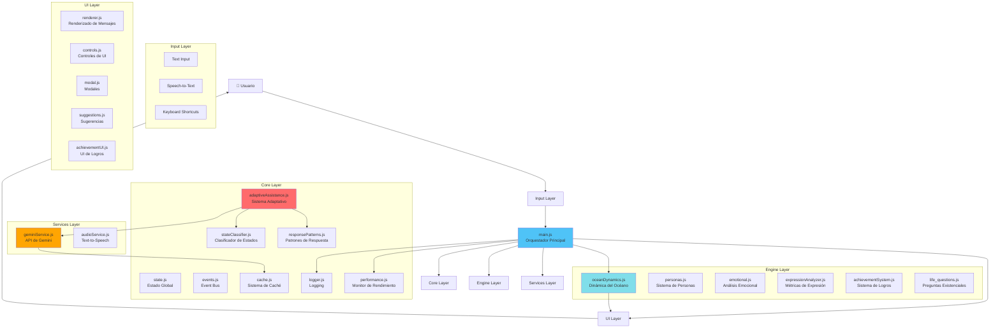
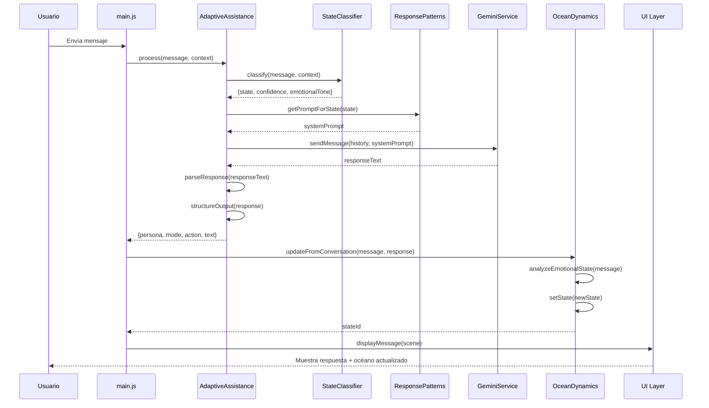
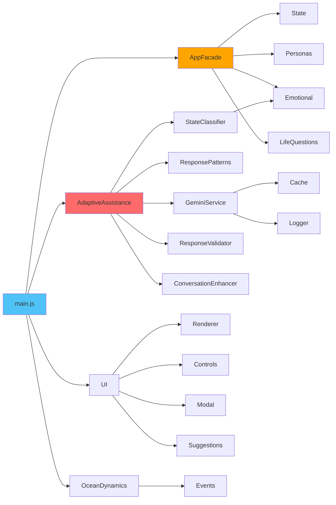

# Arquitectura Detallada - Whispers of the Wave

## Visión General

**Whispers of the Wave** es una aplicación web de chat con IA que ofrece una experiencia inmersiva con temática oceánica. La aplicación utiliza Google Gemini API y está construida con Vanilla JavaScript, sin frameworks externos.

### Características Principales

- 🌊 **Océano Dinámico**: Cambia colores y animaciones según el estado emocional
- 🤖 **IA Adaptativa**: Sistema que clasifica estados emocionales y ajusta respuestas
- 🎭 **Dos Personas**: Alternancia entre "Whispers" (poético) y "Kiro" (analítico)
- 🎤 **Speech-to-Text**: Entrada por voz
- 🔊 **Text-to-Speech**: 4 voces naturales con Gemini
- 🏆 **Sistema de Logros**: Desbloqueo basado en métricas de expresión
- 📊 **Métricas de Expresión**: Análisis de claridad, especificidad y consciencia emocional
- 🌍 **Internacionalización**: Soporte para ES, EN, FR, DE
- ⚡ **Optimización**: Lazy loading, caché, compresión de storage

## Diagrama de Arquitectura

## Flujo de Datos Principal

## Patrones de Diseño

### 1. **Singleton Pattern**
- `AdaptiveAssistance`: Una sola instancia del sistema adaptativo
- `GeminiService`: Una sola conexión con la API
- `JourneyCompletion`: Una sola instancia del sistema de completitud

### 2. **Observer Pattern**
- Event Bus (`events.js`, `eventBus.js`): Comunicación desacoplada entre módulos
- Eventos personalizados del DOM para cambios de tema, océano, logros

### 3. **Strategy Pattern**
- `ResponsePatterns`: Diferentes estrategias de respuesta según el estado
- `StateClassifier`: Diferentes estrategias de clasificación

### 4. **Facade Pattern**
- `AppFacade`: Interfaz simplificada para operaciones complejas
- Abstrae la complejidad de state, personas, emotional, etc.

### 5. **Module Pattern**
- Todos los archivos JS usan el patrón de módulo
- Encapsulación de funcionalidad
- Exposición controlada vía `window`

### 6. **Lazy Loading Pattern**
- `LazyLoader` y `LazyLoadManager`: Carga diferida de features no críticas
- Mejora el tiempo de carga inicial

## Componentes Clave

### AdaptiveAssistance (Sistema Adaptativo)

**Responsabilidades:**
- Clasificar el estado emocional del usuario
- Seleccionar el patrón de respuesta apropiado
- Generar respuestas vía Gemini API
- Validar y estructurar la salida
- Rastrear transiciones de estado

**Estados Soportados:**
- `LOST_DIRECTION`: Usuario perdido, necesita orientación existencial
- `EMOTIONAL_LOW`: Estado emocional bajo, necesita apoyo
- `SEEKING_DECISION`: Buscando ayuda para tomar decisiones
- `NEED_ORIENTATION`: Necesita pasos concretos de acción
- `SELF_EXPRESSION`: Expresión personal, necesita escucha
- `NEUTRAL_CHAT`: Conversación casual

**Acciones Correspondientes:**
- `life_questioning`: Preguntas profundas sobre propósito
- `emotional_soothing`: Consuelo emocional
- `decision_matrix`: Ayuda en decisiones
- `action_roadmap`: Plan de acción concreto
- `reflective_mirror`: Reflexión empática
- `neutral_chat`: Conversación ligera

### OceanDynamics (Dinámica del Océano)

**Responsabilidades:**
- Analizar el tono emocional de los mensajes
- Cambiar el estado visual del océano
- Gestionar transiciones suaves entre estados
- Soportar temas claro/oscuro

**Estados del Océano:**
1. **Confused** (Confusión)
   - Colores: Rojos/rosas
   - Velocidad: 8s (rápida)
   - Intensidad: Alta

2. **Anxious** (Ansiedad)
   - Colores: Naranjas
   - Velocidad: 6s (muy rápida)
   - Intensidad: Alta

3. **Processing** (Procesando)
   - Colores: Azules claros
   - Velocidad: 12s (media)
   - Intensidad: Media

4. **Clarity** (Claridad)
   - Colores: Azules muy claros/cyan
   - Velocidad: 18s (lenta)
   - Intensidad: Baja

5. **Resolved** (Resolución)
   - Colores: Verdes/pasteles
   - Velocidad: 25s (muy lenta)
   - Intensidad: Muy baja

6. **Neutral** (Neutral)
   - Colores: Azules profundos/turquesa
   - Velocidad: 15s (media)
   - Intensidad: Media

### Sistema de Personas

**Alternancia:**
- Comienza con "narrador" (Whispers)
- Alterna después de cada respuesta
- Mantiene contexto entre turnos

**Características:**
- **Narrador/Whispers**: Poético, empático, metafórico
- **Kiro**: Analítico, estructurado, práctico

### Infraestructura de Performance

**Logger:**
- Niveles: debug, info, warn, error
- Categorías: App, Storage, Cache, etc.
- Solo activo en desarrollo

**Cache:**
- Caché de respuestas de Gemini
- Reduce llamadas API duplicadas
- TTL configurable

**PerformanceMonitor:**
- Métricas de operaciones
- Tiempos de ejecución
- Reportes de rendimiento

**StorageOptimizer:**
- Compresión de localStorage
- Reducción de ~50% en espacio
- Gestión automática de cuotas

**LazyLoader:**
- Carga diferida de features no críticas
- Reducción de ~30% en tiempo de carga inicial
- Priorización de módulos críticos

## Dependencias entre Módulos

## Tecnologías Utilizadas

- **Frontend**: Vanilla JavaScript (ES6+)
- **Estilos**: CSS3 con animaciones GPU-accelerated
- **IA**: Google Gemini API
- **Voz**: Web Speech API (STT), Gemini TTS
- **Storage**: LocalStorage con compresión
- **Build**: Ninguno (sin build process)

## Métricas del Proyecto

- **Líneas de código**: ~5,000
- **Módulos JS**: 58 archivos
- **Módulos CSS**: 5 archivos consolidados
- **Funcionalidades**: 15 principales
- **Dependencias externas**: 0
- **Tiempo de carga**: ~560ms (optimizado)
- **Uso de storage**: ~110KB (comprimido)

## Extensibilidad

### Agregar un Nuevo Estado Emocional

1. Agregar estado en `OceanDynamics.states`
2. Definir colores, velocidad, intensidad
3. Agregar palabras clave en `analyzeEmotionalState()`
4. Actualizar UI si es necesario

### Agregar un Nuevo Patrón de Respuesta

1. Agregar estado en `StateClassifier`
2. Definir prompt en `ResponsePatterns`
3. Mapear acción en `AdaptiveAssistance.STATE_TO_ACTION`
4. Implementar lógica en `determineNextStep()`

### Agregar una Nueva Feature

1. Crear archivo en `js/features/`
2. Agregar a lazy loading en `index.html`
3. Documentar en `FEATURES.md`
4. Agregar tests en `tests/`

## Seguridad

- API key almacenada localmente (no en repositorio)
- Sanitización de HTML en inputs
- Validación de inputs del usuario
- Sin tracking ni analytics
- Datos almacenados solo localmente

## Rendimiento

### Optimizaciones Aplicadas

1. **Lazy Loading**: Features no críticas cargadas después
2. **Caché**: Respuestas de Gemini cacheadas
3. **Compresión**: Storage comprimido (~50% reducción)
4. **Debounce/Throttle**: Eventos optimizados
5. **GPU Acceleration**: Animaciones CSS con `transform` y `opacity`
6. **Code Splitting**: Módulos separados por funcionalidad

### Resultados

| Métrica | Antes | Después | Mejora |
|---------|-------|---------|--------|
| Tiempo de carga | ~800ms | ~560ms | -30% |
| Llamadas API duplicadas | Sí | No | 100% |
| Uso de localStorage | Sin optimizar | Comprimido | -50% |
