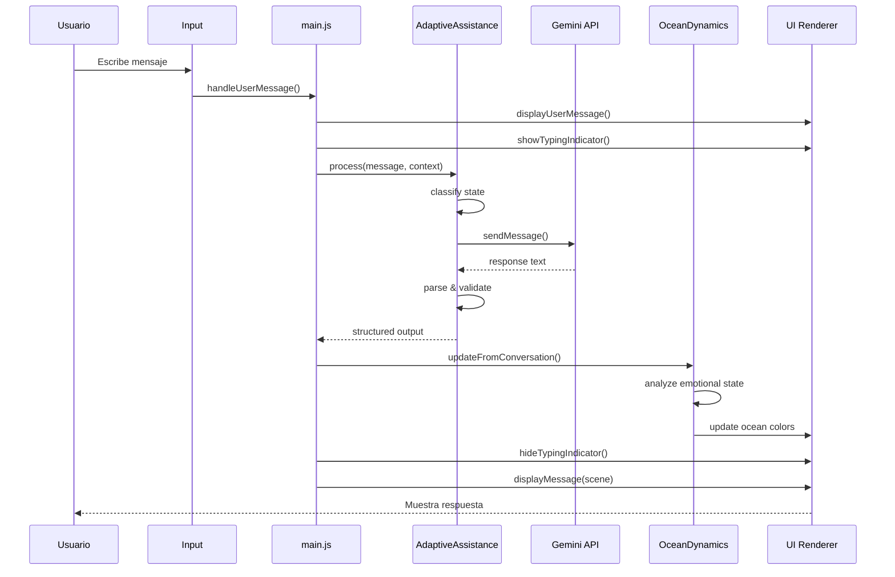

# Flujo de Datos - Whispers of the Wave

## Flujo Principal: Usuario → IA → UI



## Procesamiento de Mensaje

### 1. Entrada del Usuario
```javascript
// Input recibido
userInput.addEventListener('keypress', (e) => {
    if (e.key === 'Enter') {
        handleUserMessage(e.target.value);
    }
});
```

### 2. Validación y Preparación
```javascript
async function handleUserMessage(message) {
    // Validar
    if (!message || message.trim().length === 0) return;
    
    // Prevenir procesamiento múltiple
    if (state.isProcessing) return;
    
    setState({ isProcessing: true });
    
    // Mostrar mensaje del usuario
    displayUserMessage(message);
    clearInput();
    showTypingIndicator();
}
```

### 3. Análisis Adaptativo
```javascript
// Clasificar estado emocional
const classification = stateClassifier.classify(message, context);
// { state: 'LOST_DIRECTION', confidence: 0.85 }

// Obtener prompt apropiado
const systemPrompt = responsePatterns.getPromptForState(classification.state);

// Generar respuesta
const response = await geminiService.sendMessage(history, systemPrompt);
```

### 4. Estructuración de Respuesta
```javascript
// Parsear respuesta de Gemini
const parsed = parseResponse(response);
// { whisper: "...", reflection: "..." }

// Validar estructura
const validation = validateResponseStructure(parsed);

// Crear output estructurado
const output = {
    persona: 'kiro',
    mode: classification.state,
    action: 'life_questioning',
    text: parsed
};
```

### 5. Actualización de Océano
```javascript
// Analizar tono emocional
const oceanState = OceanDynamics.updateFromConversation(
    message,
    output,
    context
);

// Aplicar cambios visuales
OceanDynamics.setState(oceanState, true);
```

### 6. Renderizado Final
```javascript
// Crear escena
const scene = {
    whisper: output.text.whisper,
    wave: output.text.reflection,
    persona: output.persona,
    timestamp: Date.now()
};

// Mostrar en UI
displayMessage(scene, messageId);

// Actualizar historial
updateConversationHistory(message, scene);
```

## Flujos Secundarios

### Speech-to-Text
```
Usuario habla → Web Speech API → Texto → handleUserMessage()
```

### Text-to-Speech
```
Respuesta generada → Evento message:displayed → AudioService → Gemini TTS → Audio
```

### Logros
```
Mensaje procesado → ExpressionAnalyzer → Métricas → AchievementSystem → Desbloqueo
```

### Sugerencias
```
Estado del océano → SuggestionsModule → Sugerencias contextuales → UI
```

## Gestión de Estado

### Estado Global
```javascript
const state = {
    isProcessing: false,
    currentMode: 'NEUTRAL_CHAT',
    currentPersona: 'narrador',
    conversationHistory: [],
    emotionalContext: {},
    stateHistory: [],
    turnCount: 0
};
```

### Persistencia
```javascript
// Guardar en localStorage
saveToLocalStorage() {
    StorageOptimizer.set('whispers-state', state);
    StorageOptimizer.set('whispers-conversation-history', history);
}

// Cargar desde localStorage
loadFromLocalStorage() {
    state = StorageOptimizer.get('whispers-state') || defaultState;
    history = StorageOptimizer.get('whispers-conversation-history') || [];
}
```

## Eventos del Sistema

### Eventos Emitidos
- `wave:selected` - Ola seleccionada en splash screen
- `theme:changed` - Tema cambiado (claro/oscuro)
- `ocean:stateChanged` - Estado del océano cambiado
- `achievement:unlocked` - Logro desbloqueado
- `message:displayed` - Mensaje mostrado en UI
- `persona:switched` - Persona cambiada

### Eventos Escuchados
- `DOMContentLoaded` - Inicialización de la app
- `keypress` - Entrada de teclado
- `click` - Interacciones de botones
- Eventos personalizados del sistema

## Optimizaciones

### Caché
```javascript
// Antes de llamar a Gemini
const cacheKey = generateCacheKey(message, systemPrompt);
const cached = Cache.get(cacheKey);
if (cached) return cached;

// Después de recibir respuesta
Cache.set(cacheKey, response, TTL);
```

### Lazy Loading
```javascript
// Cargar features no críticas después de 1s
setTimeout(() => {
    LazyLoadManager.loadModules([
        { path: 'js/features/historySearch.js', name: 'historySearch' },
        // ...
    ]);
}, 1000);
```

### Debounce
```javascript
// Evitar múltiples llamadas rápidas
const debouncedSearch = debounce((query) => {
    performSearch(query);
}, 300);
```

## Recursos

- [ARQUITECTURA_DETALLADA.md](./ARQUITECTURA_DETALLADA.md)
- [AGENTE_SISTEMA_IA.md](./AGENTE_SISTEMA_IA.md)
- [AGENTE_SISTEMA_OCEANICO.md](./AGENTE_SISTEMA_OCEANICO.md)
